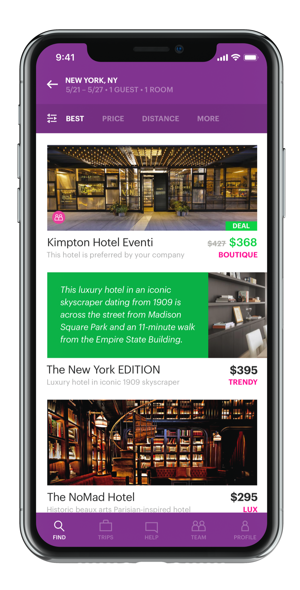

# Hotel-Recommendation
Hotel Recommendation

All online travel agencies are scrambling to meet the Artificial Intelligence driven personalization standard set by Amazon and Netflix. In addition, the world of online travel has become a highly competitive space where brands try to capture our attention (and wallet) with recommending, comparing, matching, and sharing. For this assignment, we aim to create the optimal hotel recommendations for Expedia’s users that are searching for a hotel to book. For this assignment, you need to predict which “hotel cluster” the user is likely to book, given his (or her) search details.

# Table of contents

- [Getting Started](#getting-started)
  - [Prerequisite](#prerequisite)
  - [Installation](#installation)
- [Usage](#usage)
- [Project Status](#project-status)
- [Versioning](#versioning)
- [Authors](#authors)
- [Acknowledgements](#acknowledgements)

## Getting Started
[(Back to top)](#table-of-contents)
These instructions will get you a copy of the project up and running on your local machine for development and testing purposes. See deployment for notes on how to deploy the project on a live system.

### Prerequisite
[(Back to top)](#table-of-contents)
To execute this project, you will need the following applications - 
* Pythnon 3 (or Anaconda distribution with Python 3)
* Jupyter or any other notebook
* Following Python libraries:
  * pandas
  * pandas_profiling
  * matplotlib
  * seaborn
  * numpy
  * warnings
  * datetime
  * sklearn

Find Anaconda distribution [here](https://www.anaconda.com/distribution/)

### Installation
[(Back to top)](#table-of-contents)
This particular project does not require any installation other than the required softwares and libraries mentioned above.

## Usage
[(Back to top)](#table-of-contents)
This section will be updated as the project is developed.

## Project Status
[(Back to top)](#table-of-contents)
* Business Qustion - done
* Data Acquisition - done
* EDA - done
* Data Cleansing - done
* Feature Engineering - done
* Model Building - done
* Model evaluation - done

## Versioning
[(Back to top)](#table-of-contents)
Git is used for project versioning.

## Authors
[(Back to top)](#table-of-contents)
_Anirban Pal_

## Acknowledgements
